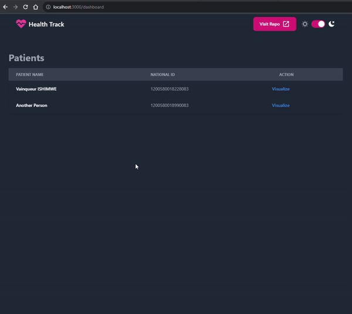

# Health Track
## Description
A simple embedded system's project to track your health. It uses a temperature sensor, a heart rate sensor and a LCD display to show the data. The data is also sent to a server using a ESP8266 module.

Later on, the data will also be analysed by a machine learning algorithm to predict the user's health and make suggestions.

## Current progress
The project is still in development. The current progress is:
- everything that's need for the backend is ready 🤗
- front-end data visualization is ready 🤗

## Technologies
- Nodejs
- Express
- Sqlite3
- Github Copilot 🤭